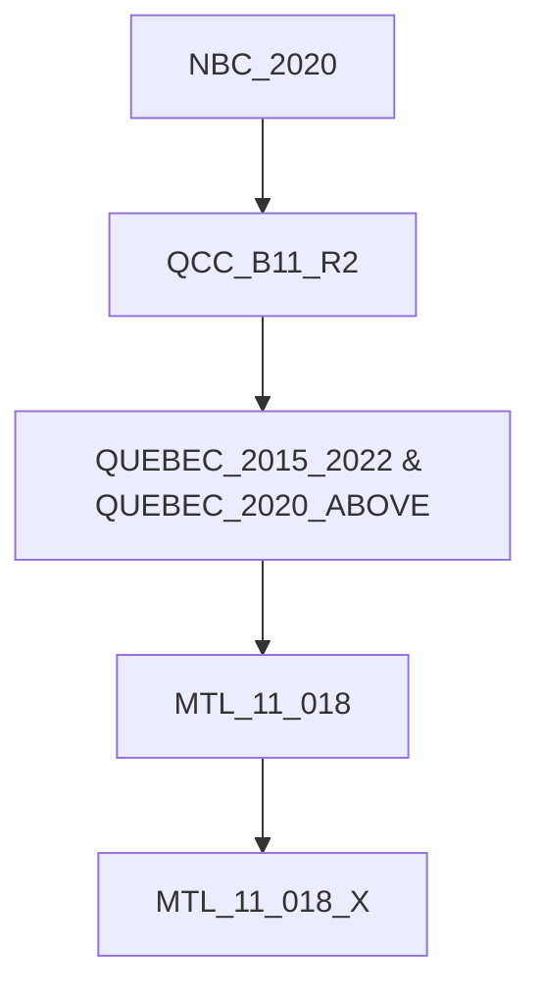
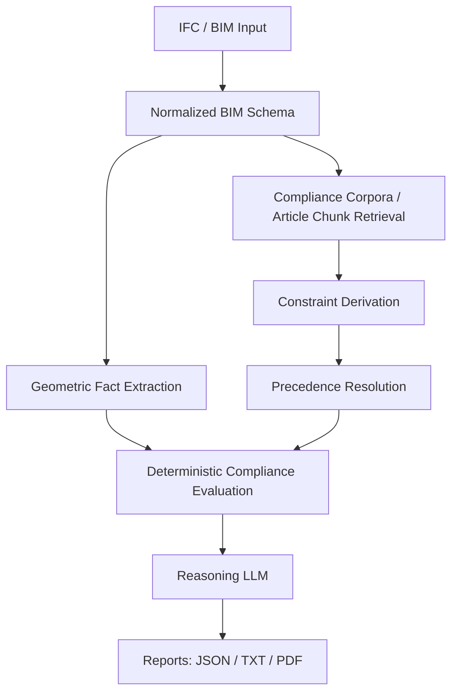

# BIM Compliance Geometric Reasoning

## High-Level Project Report

### Executive Summary

When a buyer, consultant, developer, or reviewer looks at a building or unit, one of the hardest questions is not simply "what does it look like?" but **"is it actually compliant?"** That question is difficult because compliance does not live in one place. It is distributed across national building codes, provincial construction rules, municipal bylaws, amendments, and project-specific geometry inside BIM or IFC models.

In practice, this means a person evaluating a property is forced to bridge three different worlds at once: legal text written for code interpretation, building models written for design and coordination, and risk decisions written in business language such as buy, approve, redesign, or escalate.

This project addresses that gap by building a BIM auditor as a **RAG (Retrieval Augmented Generation) based compliance pipeline** that ingests BIM/IFC data, turns normalized BIM into auditable geometric facts, retrieves relevant code articles from layered compliance corpora, resolves layered rule precedence across national, provincial, and municipal authorities, evaluates the model deterministically, and produces explainable reports with optional LLM-based reasoning for failed or uncertain cases.

The result is a system that can help answer whether a unit is compliant, which rule actually applies, whether a municipal amendment overrode the provincial or national baseline, why a space is marked **`FAIL`** or **`UNKNOWN`**, and what additional measurements are needed before a property can be assessed confidently.

---

## 1. The Problem Space

### 1.1 Why property compliance is hard to understand

A building can appear acceptable at a visual level and still fail code requirements once measurements are checked. That problem becomes worse in property acquisition or consulting because decision-makers often review incomplete floor plans, BIM exports with inconsistent properties, multiple rulebooks from different authorities, and evolving amendments that change earlier requirements.

A person trying to buy, underwrite, retrofit, or advise on a property is not just asking whether a room exists. They are asking whether doors are wide enough, bathrooms meet accessibility dimensions, bedrooms satisfy size and lighting rules, municipal rules override the provincial baseline, and the building carries hidden compliance risk.

### 1.2 Why traditional review breaks down

Traditional review is fragmented: legal review reads code documents, design review reads BIM or CAD models, and risk review reads summaries, emails, and spreadsheets. These artifacts are not aligned by default. Legal text does not directly expose computable geometry, and BIM models do not directly expose legal precedence.

That creates several failure modes, including missing rules buried in amendments, applying the wrong authority level, assuming measurements instead of deriving them, mistaking missing BIM facts for compliance, and spending excessive consulting time tracing why a rule was chosen.

### 1.3 The core challenge

The core challenge is not just "checking a rule." It is resolving this chain:

1. find the relevant legal clauses
2. determine which authority has precedence
3. convert those clauses into executable constraints
4. extract the right geometric facts from the BIM model
5. decide `PASS`, `FAIL`, or `UNKNOWN`
6. explain the decision in a way a non-engineer can use

---

## 2. What This Project Solves

This project implements a **RAG based Compliance Pipeline**.

At a high level, it ingests or normalizes BIM/IFC data into a structured intermediate schema, organizes code documents by authority and amendment layer, retrieves and resolves the active rules for a given space, and audits the geometry to produce human-readable reports.

Instead of treating compliance as a manual checklist, the project treats it as a reasoning pipeline over geometry, legal text, rule precedence, and evidence quality.

---

## 3. Why the Authority Stack Matters

One of the hardest parts of real compliance review is that the most relevant rule may not be the oldest or the most general one.

This project explicitly models the following precedence stack:

1. `NBC_2020`
2. `QCC_B11_R2`
3. `QUEBEC_2015_2022` and `QUEBEC_2020_ABOVE`
4. `MTL_11_018`
5. `MTL_11_018_X`

That means a later, more specific Montreal amendment can override the earlier Montreal bylaw, which can override Quebec-level rules, which can override the national baseline.

### Authority Precedence Diagram

---

## 4. Solution Overview

The project is built as an **end-to-end compliance reasoning system**.

### 4.1 Input side

The system can start from synthetic normalized BIM artifacts or from real IFC files ingested through `ifcopenshell`.

### 4.2 Knowledge side

Code corpora are split by authority and stored under `data/compliance_corpora/`. Each chunk can carry authority, jurisdiction, priority, effective date, article id, amendment linkage, and patch action.

### 4.3 Audit side

The system extracts geometric facts from a normalized BIM space, retrieves relevant article chunks, derives executable constraints, resolves which rule is active, compares BIM facts against the resolved rule, and emits **`PASS`, `FAIL`, or `UNKNOWN`**.

### 4.4 Reporting side

The output includes JSON audit artifacts, text reports, branded PDF summaries, and reasoning summaries for failed or uncertain cases.

---

## 5. End-to-End Architecture

### 5.1 Normalized BIM as the bridge layer

A direct raw IFC model is too awkward for consistent legal checking, while a flat room-scene JSON is too weak for realistic BIM reasoning. The project uses a **normalized BIM schema** as the middle layer, preserving project, unit, and space hierarchy, persistent ids, IFC and Revit-style element typing, geometry-derived facts, raw properties, and derived compliance facts. That normalized layer is what makes the rest of the audit pipeline stable.

---

## 6. Retrieval and Rule Resolution

This project does not rely on one retrieval signal only. It uses a **hybrid approach** that combines parameter overlap retrieval, vector similarity retrieval, and precedence-aware ranking.

### Hybrid Retrieval Logic

The system computes `overlap_score`, `semantic_similarity_score`, and `final_score = 0.7 * similarity + 0.3 * overlap`. It indexes each article chunk using authority, article id, title, and text. This matters because a code article should not be selected only because it is semantically similar. It should also match the parameters actually present in the BIM facts.

---

## 7. Deterministic Audit, Then Reasoning

This project separates **compliance evaluation** from **language generation**.

### Deterministic layer

The actual compliance decision remains **deterministic**:

- facts are extracted from BIM geometry or normalized fields
- rules are derived from structured corpora
- precedence is resolved by explicit priority
- checks produce `PASS`, `FAIL`, or `UNKNOWN`

### Reasoning layer

An optional reasoning layer then explains the result. It is used for:

- finding explanation
- precedence explanation
- unknown-case reasoning
- next-measurement recommendations
- unit-level and space-level summaries

In `llm` mode, only **`FAIL`** and **`UNKNOWN`** spaces use the LLM. `PASS` spaces remain deterministic to reduce cost and avoid unnecessary language generation. This separation is important because it keeps the audit defensible while still making the result interpretable.

---

## 8. What `UNKNOWN` Means

A major practical feature of the project is that it does not force a false pass/fail result when evidence is incomplete. **`UNKNOWN`** means the rule appears relevant, the model does not provide enough evidence to evaluate it confidently, and the system can identify which measurement is missing. That is useful for real-world consulting because many property review decisions do not fail due to known non-compliance. They fail because the information package is incomplete. In a transaction or advisory context, **`UNKNOWN` is often as important as `FAIL`** because it flags unresolved risk.

---

## 9. Why This Matters for Property Transactions and Inspections

This system is useful wherever someone needs to make a decision under compliance uncertainty. It is not just a BIM viewer and not just a legal retrieval system. What makes it useful in transaction and inspection workflows is that it combines authority-split compliance corpora, precedence-aware rule resolution, normalized BIM as an intermediate audit schema, geometry-derived facts from real IFC ingestion, hybrid retrieval over legal chunks, deterministic compliance evaluation, an optional reasoning layer for interpretation, and report packaging suitable for consulting-style output.

### For property buyers and real estate agents

It helps answer whether a unit is carrying hidden retrofit risk, whether there are spaces that cannot be approved confidently, and which deficiencies are measurable versus uncertain. For real estate agents, that matters because code uncertainty can affect pricing, negotiation posture, disclosure conversations, and how confidently a property can be positioned to clients.

### For consultants and property inspectors

It helps answer which rule should be applied in a given jurisdiction, whether the Montreal amendment was actually considered, and which dimensions need to be measured next on site or in the model. For property inspectors, the value is that the system separates observed non-compliance from missing evidence and identifies the next measurements or documents needed before an inspection conclusion is trusted.

### For insurance and bank-related inspections

It helps insurers and lenders identify whether a property carries unresolved compliance exposure that could affect underwriting, insurability, lending conditions, reserve assumptions, or post-closing remediation risk. In those workflows, **`UNKNOWN` is often just as important as `FAIL`**, because incomplete evidence can translate directly into pricing risk, conditional approval, or a requirement for further inspection.

### For developers and architects

It helps answer which spaces fail before permit or review submission, which geometry-derived facts should be fixed in the BIM model, and how code precedence should be documented in a report.

---

## 10. Conclusion

The project exists because compliance is one of the least transparent parts of property evaluation and building review. A person assessing a property does not need more disconnected PDFs and raw BIM data. They need a way to connect what is in the model, which rule applies, whether the geometry satisfies that rule, and what is still unknown.

This system implements that connection by transforming BIM geometry into auditable evidence, legal text into executable constraints, authority hierarchy into explicit precedence logic, and audit outcomes into clear reports. In short, the problem is fragmented compliance understanding, and the solution is a precedence-aware, geometry-grounded, report-producing BIM compliance auditor.
